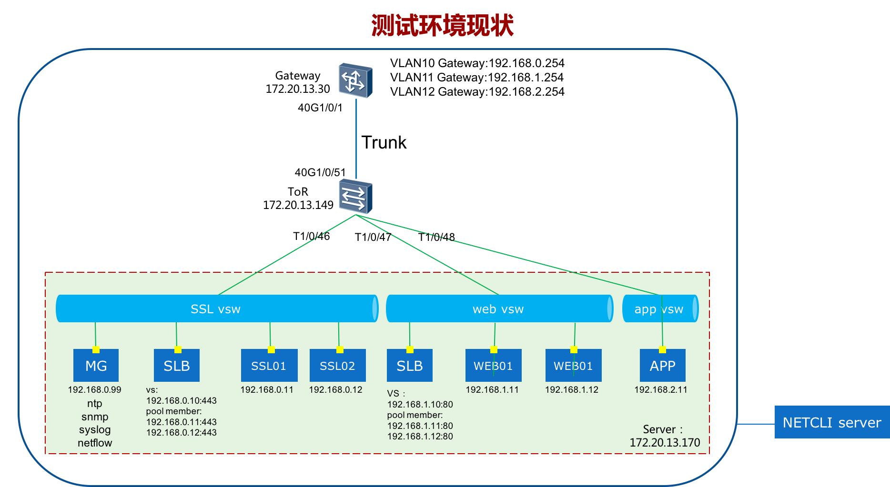

### 测试环境
  
##### 环境描述：
- 
### 交换机功能点
1.相关接口配置
- 创建VLAN、SVI接口并配置IP地址
- 配置trunk接口
- 创建port-channel接口
- 配置layer2接口
- 创建layer3接口，配置IP地址
- 创建layer3子接口，封装VLAN tag，配置IP地址
- 创建loopback接口，配置IP地址

2. 路由协议配置
- 配置静态路由
- 配置OSPF
- 配置BGP
3. 设备管理配置
- 设备堆叠
- NTP配置
- syslog配置
- SNMP配置
- NETCONF配置
- LLDP配置
- netstream/Sflow配置
- 配置保存
- 配置回滚

4. 可靠性配置
- BFD
- VRRP

5 安全性配置
- ACL配置

* * *
### 负载均衡功能点
1. ADC配置
- node配置
- pool/pool member配置
- health monitor配置
- snat pool/translate配置
- VS配置

2. 设备初始配置
- 接口配置
- 接口vlan tag配置
- NTP配置
- SNMP配置
- syslog配置
- 管理网路由配置
- 生产网路由配置

3. 高可用配置
- HA
- DSC
