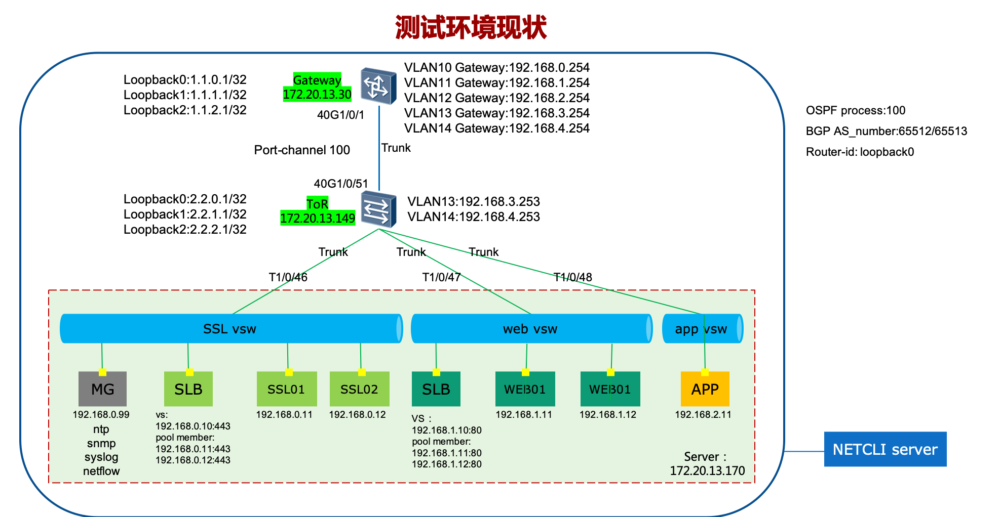

### 测试环境
  
##### 环境描述：
- Gateway交换机为华为6855，ToR为华三6800，server为物理服务器，安装ESXI，图中所有
SLB，虚机均安装在这台服务器上。
- Gateway交换机上配置VLAN10，11和12，以及各自VLAN的SVI，SVI接口的IP地址分别为这3个VLAN的网关。
* * *
##### 连通性测试
- 交换机上启用LLDP，查看LLDP邻居信息
- Gateway上配置port-channel（受环境限制，每台交换机上的port-channel使用两个接口，但仅有一组接口有光纤互联）的40G1/0/1使用 ***trunk*** 与ToR的40G1/0/51互联，并仅允许VLAN10，11，12，13和14的流量。
- ToR上配置VLAN10，11和12.并使用T1/0/46,T1/0/47,T1/0/48使用 ***trunk*** 与server网卡互联。
- 搭建一个web服务，模拟外网访问。外部用户通过gateway访问SLB（ssl），SLB将流量负载均衡到其中一台SSL上。SSL将流量转发到SLB（web），SLB将流量负载均衡到其中一台web服务器。web服务器向app服务器发起访问，展现访问结果
##### 路由协议测试
- Gateway与ToR上配置loopback0，loopback1，VLAN13，并配置SVI和IP地址
- 两台交换机配置ospf邻居，查看ospf邻居状态，并把loopback0发布到ospf中，查看路由表状态
- 两台交换机配置IBGP邻居，查看BGP邻居状态，并把loopback1发布到BGP中，查看路由表
- 两台交换机配置EBGP邻居，查看BGP邻居状态，并把loopback1发布到BGP中，查看路由表（此步骤需删除IBGP相关配置）
- 配置基于OSPF和BGP的BFD
##### 高可用测试
- Gateway与ToR上配置VLAN14，并配置SVI和IP地址
- 配置vrrp，查看vrrp状态
##### 安全性测试
- 在Gateway上SVI10配置高级ACL，允许外部用户访问ssl VS的443端口
- 在Gateway上SVI12配置标准ACL，仅允许web01访问app01
##### 负载均衡测试
- 配置sslPool，pool member为SSL01和SSL02
- 配置webPool，pool member为web01和web02
- 配置SSL member的健康检查方式为tcp。配置web member的健康检查方式为http get
- 配置sslSnatPool和webSnatPool
##### 其他通用配置（详见功能点）
* * *
***以下功能点均由自动化配置完成***
### 交换机功能点 
1. 相关接口配置
- 创建VLAN、SVI接口并配置IP地址
- 配置trunk接口
- 创建port-channel接口
- 配置layer2接口
- 创建layer3接口，配置IP地址
- 创建layer3子接口，封装VLAN tag，配置IP地址
- 创建loopback接口，配置IP地址
2. 路由协议配置
- 配置静态路由
- 配置OSPF
- 配置BGP
3. 设备管理配置
- 设备堆叠
- NTP配置
- syslog配置
- SNMP配置
- NETCONF配置
- LLDP配置
- netstream/Sflow配置
- 配置保存
- 配置回滚
4. 可靠性配置
- BFD
- VRRP
5. 安全性配置
- ACL配置
### 负载均衡功能点
1. ADC配置
- node配置
- pool/pool member配置
- health monitor配置
- snat pool/translate配置
- VS配置
2. 设备初始配置
- 接口配置
- 接口vlan tag配置
- NTP配置
- SNMP配置
- syslog配置
- 管理网路由配置
- 生产网路由配置